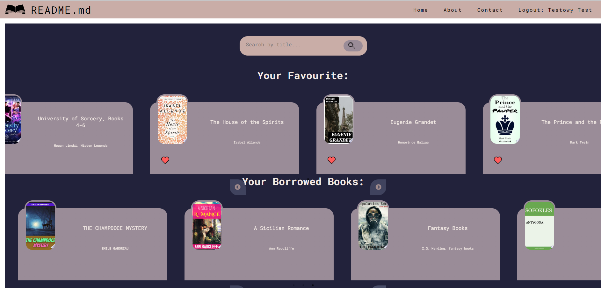

# README.md



## Project Description

README.md allows us to browse the resources of a virtual library. 
The program utilizes the Google Books API to explore the library's resources. 
This is a training project created to learn the MERN technology stack.

## Features
- You can create a new account or log in with an existing one.
- You can browse the entire library of books using the Google Books API.
- As a logged-in user, you can add books to your favorites or request to borrow a book.
- As an administrator, you can remove books from the borrowed books of all users.


## Technologies

- JavaScript
- Node.js
- Express.js
- MongoDB
- React


## Running the Project

To run the project, follow these steps:

Clone the repository to your device.

```bash
git clone https://github.com/KamilSadlocha/README.md.git
```


### Backend

1. In 'server' folder crete .env file and configure database connection.

2. Run backend:

```
node server.js 
```

### Frontend 

1. Navigate to 'client' folder.

2. Install all required dependencies to run the project. You can use npm:

```
npm install
```

3. Create api-key.js in client/src/ folder and add Your Google Books API key:

```javascript
const googleBooksApi = 'YOUR GOOGLE BOOK API KEY'

export default googleBooksApi;
```

4. Run the frontend application:

```
npm start
```


